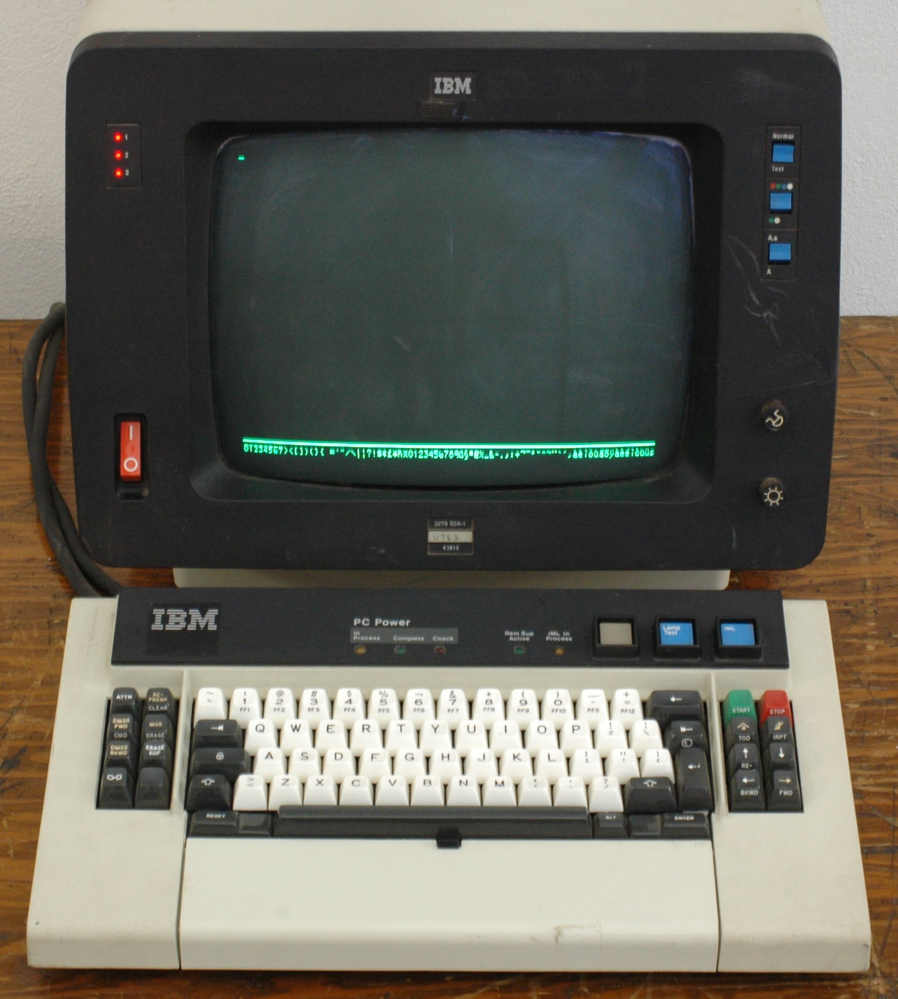
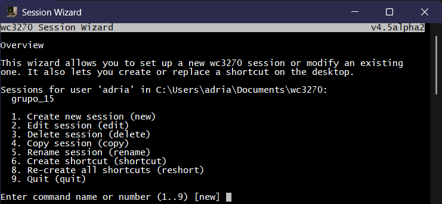
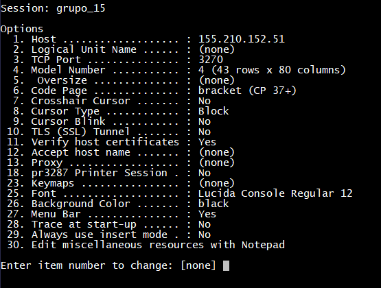
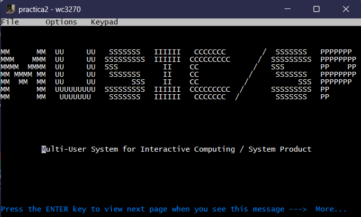
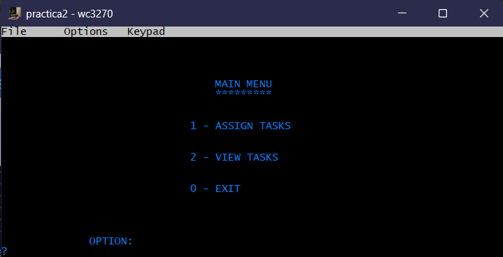

# Práctica 2 — Sistemas Legados

## Encapsulado de aplicación legada vía TN3270

**Grado:** Ingeniería Informática \\
**Asignatura:** Sistemas Legados \\
**Curso:** 2025/2026 \\
**Grupo:** XX \\
**Autores:** Adrián Nasarre, Enrique Baldovín, Jorge Lucas \\
**Fecha:** 06/10/2025

## Índice

- [Objetivo](#objetivo)
- [Descripción del sistema legado](#descripción-del-sistema-legado)
- [Emulador y acceso (wc3270)](#emulador-y-acceso-wc3270)
- [Arquitectura de la solución](#arquitectura-de-la-solución)
- [Interacción con el mainframe (flujo)](#interacción-con-el-mainframe-flujo)
- [Operaciones disponibles en la GUI](#operaciones-disponibles-en-la-gui)
- [Dificultades encontradas y cómo las resolvimos](#dificultades-encontradas-y-cómo-las-resolvimos)
- [Guía de ejecución en Windows (doble clic)](#guía-de-ejecución-en-windows-doble-clic)
- [Pruebas realizadas (manuales e2e)](#pruebas-realizadas-manuales-e2e)
- [Cronograma de trabajo (detallado)](#cronograma-de-trabajo-detallado)
- [Reparto de tareas y esfuerzo](#reparto-de-tareas-y-esfuerzo)
- [Proceso del proyecto y organización de ficheros](#proceso-del-proyecto-y-organización-de-ficheros)
- [Anexos técnicos](#anexos-técnicos)
- [Conclusiones](#conclusiones)
- [Referencias](#referencias)

# Memoria técnica — Práctica 2: Encapsulado de aplicación legada vía TN3270

## Objetivo

Implementar una aplicación con interfaz gráfica (GUI) que permita acceder a una aplicación legada (gestor de tareas `tasks.c`) ejecutada sobre un mainframe IBM ESA/390 con sistema operativo MUSIC/SP, mediante terminal TN3270. La GUI debe encapsular el acceso y ofrecer operaciones de listar y crear tareas.

## Descripción del sistema legado

- Plataforma: IBM ESA/390 (familia de mainframes)
- Sistema operativo: MUSIC/SP, similar a OS/360/OS/390/MVS. Se accede con terminales 3270.
- Terminales IBM 3270: pantallas de caracteres (green screens) introducidas en 1972. Hoy se usa su emulación por software (TN3270) sobre TCP/IP.
- Emulador: x3270/wc3270, con versión “displayless” para automatización (s3270/ws3270). En Windows usamos `ws3270.exe` para screen scraping.

## Emulador y acceso (wc3270)

Para abrir una sesión TN3270 se instaló wc3270 (SourceForge). Pasos seguidos con Session Wizard (por defecto):

1. Create New Session y asignar un nombre (p. ej. `practica2`).
2. IP del mainframe: `155.210.152.51`.
3. Cambiar puerto TCP: escribir `3` + Enter, luego `3270` + Enter.
4. Finalizar para crear `practica2.ws` y crear acceso directo.

Imágenes de apoyo:

- Creación de sesión

  

- Opciones de sesión

  

- Menú de MUSIC/SP y comandos

  

- Menú principal del emulador

  

## Arquitectura de la solución

La solución encapsula la interacción 3270 y expone una GUI web moderna.

- Backend: Python + Flask (`Entrega/GestorDeTareas/app.py`).
- Automatización 3270: `py3270` sobre `ws3270.exe` (displayless). Lógica en `Entrega/GestorDeTareas/lib/emulator.py`.
- Frontend: HTML/CSS + plantillas Jinja2 (`templates/`) y JS para filtrado (`static/filtro.js`).
- Empaquetado portable: Python embebido y lanzador `.bat` para ejecutar sin instalar nada en el equipo.

Diagrama simple de flujo:

1. Login desde la GUI → `emulator.emulador(usuario, contraseña)`.
2. Navegación automática: bienvenida → login → `tasks.c` → View Tasks (2) → All Tasks (3).
3. Screen scraping: captura todas las páginas de "ALL TASKS", parseo y cache en memoria.
4. GUI muestra la tabla. Acciones: crear tarea general/específica, refrescar, salir.

## Interacción con el mainframe (flujo)

Secuencia probada primero manualmente en el emulador y posteriormente automatizada:

1. Pantalla de bienvenida MUSIC/SP → Enter.
2. Introducir `Userid` y `Password` → Enter.
3. Pantalla de espera → Enter.
4. Línea de comandos → escribir `tasks.c` → Enter.
5. Menú de la app:
   - `1` ASSIGN TASKS
   - `2` VIEW TASKS
   - `0` EXIT
6. Para listar todas: `2` (VIEW TASKS) → `3` (ALL TASKS); para volver, Enter.

En la automatización se usan:

- `wait_for_field()` + `send_string()` + `send_enter()` coordinados.
- Pequeños `sleep` (del orden de 1–2 s) para evitar caídas por exceso de velocidad, siguiendo el enunciado de la práctica.

## Operaciones disponibles en la GUI

La GUI expone las tres operaciones principales de la app legada y dos utilidades:

- Listar tareas (equivale a View Tasks → All Tasks). Botón "Refrescar".
- Añadir tarea General. Formulario con: Fecha y Descripción (sin espacios).
- Añadir tarea Específica. Formulario con: Fecha, Nombre (sin espacios), Descripción (sin espacios).
- Filtrar en cliente: desplegable "Todas/Generales/Específicas" (no reconsulta al mainframe; actúa sobre la tabla cargada).
- Salir: cierra sesión TN3270 y vuelve al inicio.

Rutas relevantes (backend):

- `/` (GET): login.
- `/ini` (POST): realiza el login contra TN3270. Retornos: 0 ok, 1 error credenciales/conexión, 2 usuario en uso, -1 error.
- `/assignGeneral` (POST) y `/assignEspecifica` (POST): crean tareas y vuelven al listado actualizado.
- `/refresh` (POST): relanza View Tasks → All Tasks y actualiza la tabla.
- `/exit` (POST): cierra sesión TN3270 (`off`) y termina el emulador displayless.

## Dificultades encontradas y cómo las resolvimos

A continuación se detallan los problemas más relevantes, su análisis y la solución aplicada.

### 1) Sincronización y tiempos de espera

- Síntoma: combinaciones rápidas de `send_string` + `send_enter` provocaban pantallas incompletas, pérdida de foco o bloqueos temporales.
- Causa: el host MUSIC/SP requiere tiempos mínimos entre interacciones para procesar y "pintar" la siguiente pantalla.
- Solución:
  - Uso consistente de `e.wait_for_field()` antes de enviar datos o Enter.
  - Sleeps cortos y parametrizables (1–2 s) colocados en puntos clave (tras login, antes de menús, etc.).
  - En `return_main_menu()` y `_ensure_view_tasks_menu()` se incorporaron bucles con reintentos para normalizar el estado.

### 2) Estados intermedios y pantallas especiales

- Síntoma: aparición ocasional de "ENTER ANY KEY TO CONTINUE" o retornos al menú intermedio de "VIEW TASKS".
- Solución: funciones robustas que detectan estas cadenas y envían `Enter` o re-seleccionan la opción necesaria hasta alcanzar el estado deseado.
- Beneficio: mayor resiliencia ante latencias variables o flujos ligeramente distintos.

### 3) Paginación del listado "ALL TASKS"

- Reto: el listado puede ocupar múltiples pantallas y, si simplemente concatenamos, se repiten líneas al navegar.
- Solución:
  - `capture_all_tasks_pages()` avanza con `Enter` hasta detectar `TOTAL TASKS`.
  - Se acumulan sólo líneas que cumplen `^TASK #n:` y se deduplican por ID para evitar repeticiones.
  - Se guarda un volcado en `pantalla_lista_todas_las_tareas.txt` y, cuando es posible, HTML de referencia.

### 4) Parseo flexible de General vs Specific

- Reto: el formato de General incluye separadores con guiones; Specific incluye nombre entre espacios.
- Solución: expresiones regulares tolerantes a espacios y variantes, con limpieza de comillas y guiones.
- Resultado: estructura uniforme con campos `{id, tipo, fecha, descripcion, nombre=None|str}` consumida por Jinja.

### 5) Usuario en uso y errores de credenciales

- Detección: `Userid is in use`, `Userid is not authorized`, `Password incorrect` en coordenadas conocidas.
- Tratamiento: `comprobar_salida_login()` discrimina retornos (0/1/2) para mostrar pantallas específicas en la GUI.
- Prevención: en la salida se llama a `exit_tasks()` y se anima al usuario a utilizar el botón "Salir" para liberar la sesión.

### 6) Fiabilidad de ws3270 y PATH en Windows

- Reto: asegurar que `ws3270.exe` se encuentre sin instalación global.
- Solución: el lanzador añade `Entrega/GestorDeTareas` al `PATH` del proceso; en `emulator.py` se refuerza detectando y añadiendo la carpeta de `ws3270.exe` antes de crear `Emulator()`.

### 7) Red y firewall

- Observación: el puerto 3270 debe estar accesible; firewalls corporativos pueden bloquear.
- Guía: si no se conecta, comprobar conectividad TCP hacia `155.210.152.51:3270` y repetir la configuración de la sesión en wc3270.

### 8) Evidencias y depuración

- En caso de vacíos inesperados, se vuelcan pantallas timestamp (`dump_screen_debug`) y se registran eventos en `app.log`.
- Esto facilitó reproducir condiciones de carrera y ajustar tiempos/esperas.

### 9) Limpieza de artefactos de depuración (.txt)

Con el objetivo de evitar residuos en el directorio de trabajo, se ha desactivado la creación de ficheros `.txt` que se usaban exclusivamente para depuración:

- `dump_screen_debug(...)` ya no crea archivos en disco; en su lugar emite un log informativo con el prefijo y el timestamp.
- En `lib/emulator.py` se han comentado las llamadas a `pantalla("Emulador_login_fin.txt")`, `pantalla("assign_tasks_ini.txt")`, `pantalla("assign_tasks_general_fin.txt")`, `pantalla("assign_tasks_especifica_fin.txt")`, `pantalla("Assign_task_fin.txt")` y `pantalla("Refresh_all_task_fin.txt")`.
- La funcionalidad de la aplicación no se ve afectada; se mantiene el registro en `app.log` y el flujo normal de navegación.

Si fuera necesario reactivar temporalmente estos artefactos para diagnosticar un problema, basta con descomentar las líneas indicadas y, opcionalmente, restaurar la escritura en `dump_screen_debug`.

## Guía de ejecución en Windows (doble clic)

Esta sección describe todo lo necesario para ejecutar la práctica desde Windows sin instalaciones previas.

1. Descargar/obtener la carpeta `Entrega/` completa.
2. Doble clic en `Entrega/GestorDeTareas.bat`.
   - Primera vez: `launcher.bat` descargará Python embebido (requiere Internet) y preparará `pip` + dependencias. Esta preparación queda cacheada en `Entrega/python-embed/`.
   - Siguientes veces: ya no hace falta Internet; arranca directamente.
3. Se abrirá una consola con logs y la ventana de la app.
4. Introducir credenciales (usuario `grupo_XX`, clave inicial `secreto6` si aplica) y pulsar Acceder.
5. Tras el login (puede tardar varios segundos), aparecerá el listado de tareas.
6. Para cerrar correctamente, usar el botón “Salir” para liberar la sesión TN3270.

Notas útiles:

- Logs: `Entrega/GestorDeTareas/app.log`.
- Binario TN3270: `Entrega/GestorDeTareas/ws3270.exe`.
- Dependencias: `Entrega/GestorDeTareas/requirements.txt` (Flask, pywebview, six).
- Si el navegador no abre automáticamente, la app corre en `http://127.0.0.1:5000` (cuando no se use pywebview).

## Pruebas realizadas (manuales E2E)

- Login correcto: credenciales válidas → entra, navega a `tasks.c`, muestra All Tasks.
- Password incorrecta: muestra "error" y permite reintentar.
- Usuario en uso: muestra pantalla específica y no continúa.
- Crear tarea General: completa fecha + descripción (sin espacios) → aparece en el siguiente refresco de All Tasks.
- Crear tarea Específica: completa fecha + nombre + descripción (sin espacios) → aparece en el siguiente refresco.
- Refrescar: reabre View Tasks → All Tasks, captura multipágina, parsea y actualiza.
- Filtrar: General/Specific/Todas actúa sin recargar servidor (JS).
- Salir: libera sesión y no deja el usuario ocupado.

Casos de error:

- Red caída: timeout/errores en login; revisar conexión a 155.210.152.51:3270.
- Latencia alta: pantallas pueden tardar más; las funciones resilientes reintentan.
- Fallo en parseo: se conserva la lista cacheada y se vuelca pantalla para análisis.

Evidencias:

- Ficheros `*_fin.txt` y `pantalla_lista_todas_las_tareas.*` en `Entrega/GestorDeTareas/`.
- `app.log` con marcas de tiempo y pasos de navegación.

## Cronograma de trabajo (detallado)

- Día 1
  - Instalación y configuración de wc3270.
  - Acceso al mainframe y pruebas manuales de `tasks.c`.
- Día 2
  - PoC con `py3270` y `ws3270`: conexión, login y `wait_for_field`.
  - Primer volcado de pantallas y validación de timings.
- Día 3
  - Implementación de `capture_all_tasks_pages()` y `parse_all_tasks()`.
  - Manejo de `TOTAL TASKS` y deduplicación por ID.
- Día 4
  - Construcción de GUI (Flask + Jinja) y flujo de login → listado.
  - Estilos, badges y estructura de tabla.
- Día 5
  - Altas (General/Específica), validaciones en cliente, refresco y salida.
  - Funciones de robustez de navegación: `return_main_menu()`.
- Día 6
  - Empaquetado portable con Python embebido y lanzador `.bat`.
  - Batería de pruebas E2E y ajustes finales.

## Reparto de tareas y esfuerzo

| Autor            | Tareas principales                                                | Horas |
| ---------------- | ----------------------------------------------------------------- | ----- |
| Adrián Nasarre   | Automatización TN3270, GUI, empaquetado y soporte ejecución       | 19    |
| Enrique Baldovín | Flujo de login, parseo robusto, resiliencia y estados intermedios | 19    |
| Jorge Lucas      | Interfaz, JS filtrado, pruebas integrales y documentación         | 19    |

## Proceso del proyecto y organización de ficheros

Esta sección documenta el flujo de trabajo seguido, las decisiones de diseño y cómo se organizó el código y los artefactos para hacer el sistema mantenible y portable.

### Fases del desarrollo

1. Análisis y pruebas manuales

- Objetivo: entender el flujo exacto en MUSIC/SP y `tasks.c` desde un terminal 3270 real.
- Resultado: diagrama de navegación y tiempos mínimos entre pantallas, con validación de estados y mensajes.

2. Prototipo de emulación (POC)

- Implementamos una prueba mínima con `py3270` + `ws3270` para: conectar, logar, navegar a `tasks.c` y leer pantallas.
- Verificamos que el binario `ws3270.exe` podía co-existir junto a la app y resolverse por PATH.

3. Diseño de API interna

- Decidimos encapsular la interacción de bajo nivel en `lib/emulator.py` exponiendo funciones de alto nivel: `emulador`, `assign_tasks`, `refresh_all_tasks`, `exit_tasks`, etc.
- Acordamos un formato de datos estable para la GUI: lista de dicts con `{id, tipo, fecha, descripcion, nombre}` para desacoplar el parseo de la presentación.

4. GUI y validaciones cliente

- Construimos plantillas Jinja (`templates/`) y un script JS (`static/filtro.js`) para filtrar en cliente y mantener UX fluida.
- Validaciones básicas en formularios (sin espacios en General/Specific donde aplica) y modales para altas.

5. Robustez y estados

- Añadimos funciones como `return_main_menu()` y `capture_all_tasks_pages()` con reintentos y detección de pantallas especiales.
- Introdujimos `dump_screen_debug()` y caché `_last_all_tasks` para resiliencia ante fallos puntuales.

6. Empaquetado portable

- `launcher.bat` automatiza descarga de Python embebido, pip y dependencias, corrige `python312._pth` y lanza la app con el `PATH` adecuado.
- `GestorDeTareas.bat` ofrece un único punto de entrada por doble clic.

7. Validación y documentación

- Pruebas E2E (felices y de error), ajuste de tiempos y errores comunes.
- redacción de la memoria técnica con imágenes.

### Organización de carpetas y archivos

- `Entrega/`
  - `GestorDeTareas.bat`: lanzador principal (doble clic) que invoca `launcher.bat`.
  - `launcher.bat`: prepara Python embebido y dependencias, ajusta PATH y ejecuta `app.py`.
  - `Imagenes/`: recursos gráficos incluidos en la memoria.
  - `python-embed/`: runtime de Python portable (auto-generado/descargado), con `Lib/`, `Scripts/` y binarios.
  - `GestorDeTareas/`: raíz de la aplicación.
    - `app.py`: aplicación Flask; rutas, arranque web/pywebview, logging y orquestación de flujos.
    - `requirements.txt`: dependencias Python (Flask, pywebview, six).
    - `ws3270.exe`: emulador displayless 3270 para Windows.
    - `app.log`: log de ejecución (generado), útil para soporte.
    - `templates/`: vistas Jinja2
      - `index_inicio.html`: login.
      - `index_inicio_error.html`: error genérico de acceso.
      - `index_inicio_ocupado.html`: usuario en uso.
      - `tareas.html`: tabla de tareas y modales para altas.
    - `static/`
      - `filtro.js`: filtrado en cliente y persistencia del filtro en localStorage.
    - `lib/`: capa de emulación y scraping
      - `emulator.py`: funciones de alto nivel para TN3270, parseo y navegación robusta.
      - `py3270.py`: librería para comunicarse con x3270/s3270/wc3270/ws3270 (incluye `Emulator`, `Wait`, `String`, `Ascii`, etc.).
    - Artefactos de depuración y pantallas guardadas (generados):
      - `pantalla_lista_todas_las_tareas.txt` / `.html`, `*_fin.txt`, `after_*_empty_*.txt`, etc.

Racional de esta organización:

- Separación de responsabilidades: Flask (web) vs emulación/parseo (`lib/`) vs presentación (`templates/` y `static/`).
- Portabilidad: todo lo ejecutable para TN3270 (ws3270) y Python runtime via `python-embed` residen bajo `Entrega/`.
- Soporte: logs y pantallas para reproducibilidad de incidentes.

### Decisiones técnicas y alternativas consideradas

- Lenguaje: Python por disponibilidad de `py3270` y rapidez de iteración.
- GUI: Flask + HTML/CSS/JS por sencillez y flexibilidad (frente a Java Swing/FX o .NET WinForms/WPF que requerían más montaje).
- Emulador: `ws3270` displayless por su integración natural con `py3270`; alternativa habría sido `wc3270` visible con scripting por socket (más complejo de orquestar y frágil para empaquetar).
- Empaquetado: Python embebido y BATs frente a instaladores MSI o PyInstaller (este último complica bundling del binario `ws3270.exe` y drivers SSL/TLS dependiendo del entorno).
- Parseo: regex tolerantes vs dictado estricto de columnas; elegimos tolerancia a variaciones para resiliencia.

### Mantenimiento futuro

- El código facilita ajustes de tiempo y reintentos en una sola capa (`emulator.py`).
- Es sencillo extender rutas Flask para nuevas operaciones (p. e
